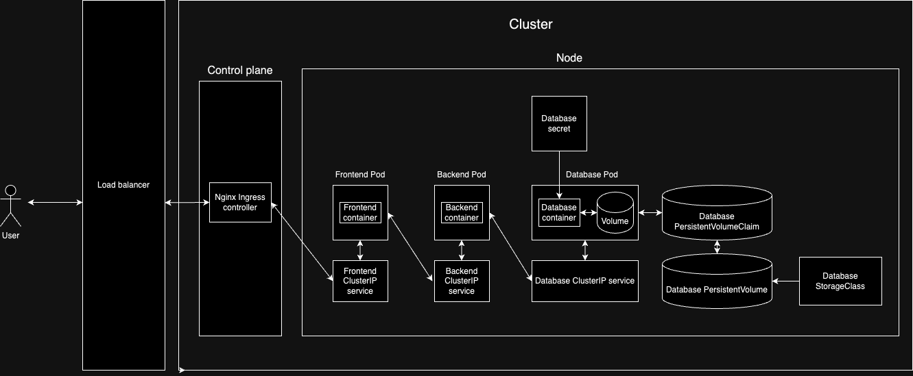

# About the project

This is a fullstack application utilizing `Terraform` for infrastructure provisioning and `Kubernetes` for container orchestration. The application contains a simple yet sufficient functionality to make use of 3 application layers - frontend, backend, database.

## Architecture

## Features

- `Environment based architecture`. Project's infrastructure is divided into environments, creating separation of concerns, and making it possible to tweak the environment setup based on needs.
- `Infrastructure as code`. Project uses `Terraform` scripts to provision VPC, Subnets, EKS Cluster, Node Group, and necessary IAM roles. It also makes use of S3 backend and contains code to provision a replica of such backend in other envionments.
- `CI/CD pipelines`. Project automates deployment of infrastructure, application, building of application artifacts, publishing artifacts to ECR, and connecting domains.
- `Container orchestration`. Project utilizes `Kubernetes` and `Helm` package manager for container orchestration.

## Deployment

_Build_

1. [Deploy infrastructure](.github/workflows/dev-deploy-infra.yaml)
2. Build and publish application artifacts ([Backend](.github/workflows/dev-build-backend.yaml), [Frontend](.github/workflows/dev-build-frontend.yaml))
3. [Deploy Kubernetes resources](.github/workflows/dev-deploy-application.yaml)

_Tear down_

1. Remove Kubernetes resources
2. Remove Ingress
3. [Destroy infrastructure](.github/workflows/dev-destroy-infra.yaml)
4. Remove images from ECR
